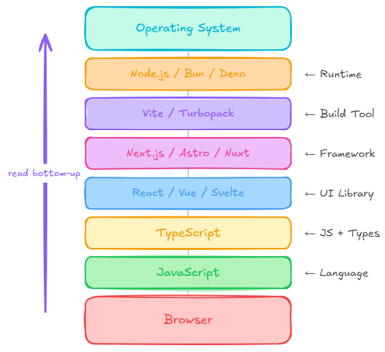

Pick any job posting, any conference talk, any "what should I learn?" thread, and you'll see the similar names in the same breath: **React**, **Astro**, **Next.js**, **TypeScript**, **Vite**, **Node.js**. It reads like a shopping list of competing frameworks.

> It isn't. These tools sit at **different layers** of the same stack. Once you see the layers, the overlap stops feeling confusing and starts feeling obvious.

<br>

## 🧩 The short version

- **JavaScript** is the language. Everything else is built on top of it.
- **TypeScript** adds types to JavaScript. Browsers still only run JavaScript.
- **React** is a UI library. It handles components, state, rendering. Not routing, not a server.
- **Next.js** wraps React into a full application framework (routing, SSR, APIs).
- **Astro** is a content-first framework that ships mostly static HTML and loads JS only where you need it.
- **Vite** (and Turbopack) are build tools. They compile and bundle your code during development and production.
- **Node.js** (and Bun, Deno) are runtimes. They execute JavaScript outside the browser.

When someone says *"I'm using Astro with React and TypeScript,"* they're not picking between rivals. They're stacking layers.

<br>


## 📦 The stack, top to bottom



Read it from the bottom up: the browser runs JavaScript. Everything above is tooling that helps you write, check, structure, and ship that JavaScript.

<br>

```text
Operating System
        │
Node.js / Bun / Deno        ← Runtime
        │
Vite / Turbopack            ← Build Tool
        │
Next.js / Astro / Nuxt      ← Framework
        │
React / Vue / Svelte        ← UI Library
        │
TypeScript                  ← JavaScript + Types
        │
JavaScript                  ← Language
        │
Browser
```

<br>

## 🧩 A (not so) deep dive

### 🌐 JavaScript — the language

JavaScript is the only language browsers natively execute. Every framework, every build tool, every "modern web" conversation eventually compiles down to it.

That single constraint explains most of the stack. TypeScript exists because JavaScript doesn't have static types. Build tools exist because browsers don't understand JSX, imports, or Sass out of the box. Runtimes exist because sometimes you want JavaScript on a server, not in a tab.

<br>

### TypeScript — JavaScript with guardrails

TypeScript is **JavaScript with static type checking**. It catches an entire category of mistakes before your app runs:

```ts
function greet(name: string): string {
  return `Hello ${name}`;
}
```

One rule worth memorizing: **browsers do not understand TypeScript.** Something has to compile it first:

```text
TypeScript
      ↓
TypeScript Compiler (tsc)
      ↓
JavaScript
      ↓
Browser
```
<br>

### The new Type on the Block: TypeScript 7

TypeScript 7 reached **general availability on July 8, 2026**. Microsoft describes it as a native port (written in Go), not a rewrite — the type-checking logic is structurally identical to TypeScript 6.0, so code that compiles cleanly on 6.0 compiles the same way on 7.0.

What changed is speed. Microsoft reports full-build speedups typically between **8× and 12×**, plus faster editor startup and IntelliSense on large projects, driven by native code execution and multi-threaded type-checking.

One caveat: tools that depend on the compiler's programmatic API — `typescript-eslint`, `ts-morph`, custom transformers — should stay on TypeScript 6.0 until [TypeScript 7.1](https://devblogs.microsoft.com/typescript/) ships a stable API.

<br>

### React — the UI layer

React is a **UI library**. Its job is building interfaces from reusable components:

```tsx
function Button() {
  return <button>Hello</button>;
}
```

What React deliberately does *not* include: routing, authentication, data fetching conventions, or a backend. It's a rendering engine with a component model — powerful, but intentionally incomplete on its own.

<br>

## Next.js — React, fully dressed

Next.js is a **framework built on React**. It fills in everything React leaves out:

- File-based routing
- Server-side rendering and static generation
- API routes
- Image optimization
- Full-stack deployment patterns

If React is the engine, Next.js is the car around it — opinionated, batteries-included, ready to drive.

<br>

### Astro — content first, JavaScript last

Astro takes a different bet:

> Ship as little JavaScript as possible.

Most pages are pre-rendered to fast static HTML at build time. Interactive pieces such as search boxes, theme toggles, comment widgets, hydrate as small "islands" that load their own JavaScript. Everything else stays inert markup.

An Astro page can still contain React components (or Vue, Svelte, and others). The framework isn't anti-React; it's anti-shipping React to pages that don't need it.

```text
Page
 ├── Static HTML
 ├── React Search Box      ← island
 ├── Vue Widget            ← island
 └── Static Footer
```

This is the model this blog uses: Markdown compiles to HTML at build time, and a Preact island handles the theme toggle. No runtime Markdown parser, no client-side router — just pages.

<br>

### Build tools — the compiler pipeline

**Vite** and **Turbopack** sit between your source code and what actually ships. They handle:

- Transpiling TypeScript and JSX
- Bundling modules for the browser
- Hot module replacement during development
- Production optimizations (tree-shaking, code splitting)

<br>

> They're developer infrastructure, not application frameworks. Astro uses Vite under the hood; Next.js has its own bundler story. You rarely choose a build tool in isolation — your framework usually picks one for you.

<br>

### Runtimes — JavaScript off the browser

A **runtime** executes JavaScript outside the browser. **Node.js** is the default; **Bun** and **Deno** are newer alternatives with different trade-offs.

Runtimes power:

- Local dev servers and build scripts
- API backends and serverless functions
- CLI tools and automation

When you run `npm run dev` or `npm run build`, a runtime is doing the work — even if the final output is plain HTML with no server at all.

<br>

---

## 🤔 So which tool should I use?

There's no universal winner. There's a fit for the problem:

| Goal | A good default |
|---|---|
| Blog or personal site | Astro |
| Documentation site | Astro |
| Portfolio | Astro |
| Marketing / company site | Astro |
| SaaS product | Next.js |
| Dashboard with live data | Next.js |
| Large enterprise app | Next.js or Angular |

The pattern: **content-heavy, mostly static sites** favor Astro's island architecture. 

**Interactive applications with lots of client state** favor Next.js (or similar full-stack React frameworks). The reason for this is that Next.js is a full-stack framework that allows you to build interactive applications with lots of client state.

> Neither choice is a moral judgment. Hugo would also be a fine pick for a blog. The point is knowing *why* you're picking a layer, not memorizing a brand name.

<br>

## Mental model

Keep this cheat sheet handy:

| Layer | Role | Examples |
|---|---|---|
| Language | What you write | JavaScript |
| Types | Catch errors early | TypeScript |
| UI library | Build interfaces | React, Vue, Svelte |
| Framework | Structure the whole app | Next.js, Astro, Nuxt |
| Build tool | Compile and bundle | Vite, Turbopack |
| Runtime | Run JS outside the browser | Node.js, Bun, Deno |

<br>

> The modern web stack isn't a maze of competing frameworks. It's a set of layers you assemble based on what you're building. Learn the layers, and the tool names stop being noise.

<br>

## References

1. [TypeScript Documentation](https://www.typescriptlang.org/docs/)
2. [Microsoft TypeScript Blog](https://devblogs.microsoft.com/typescript/)
3. [React Documentation](https://react.dev/)
4. [Astro Documentation](https://docs.astro.build/)
5. [Next.js Documentation](https://nextjs.org/docs)
6. [Vite Documentation](https://vite.dev/)
7. [Node.js Documentation](https://nodejs.org/docs/latest/api/)

<br>

## Acknowledgments 🤝

Written by [@kunalsuri](https://github.com/kunalsuri) using AI-Powered tools from Anthropic's Claude [@claude](https://github.com/claude) and Google's Gemini [@google](https://github.com/google).